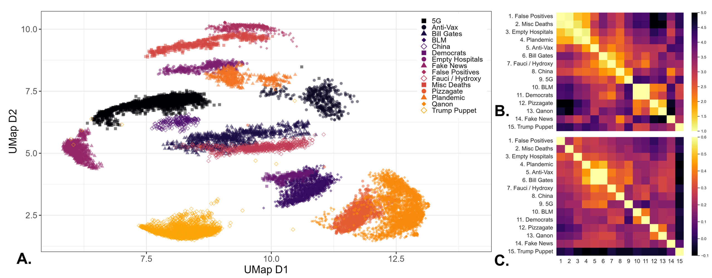
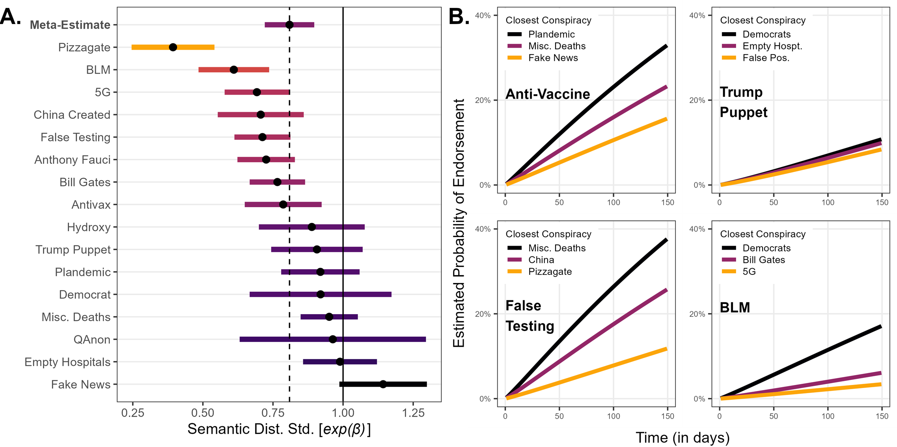

# Prompt-Tuned Conspiracy Theory Classification on Twitter using Large Language Models
This repository provides the data and code needed to replicate "Semantic proximity underlies progression in the endorsement of multiple conspiracy theories by individuals." Paul Vicinanza, Echo Zhou, Hayagreeva Rao, and Henrich Greve. 2024. 

Theoretically, this paper seeks to understand the sequential process of conspiracy endorsements on Twitter. We find that users jump to semantically similar but more extreme conspiracy theories over time. However, prominent cultural events, in our case the murder of George Floyd and subsequent Black Lives Matter protests, may lead users to endorse semantically distant conspiracy theories.

The core methodological task of the paper is to classify tweets as endorsing, or not endorsing, a given conspiracy theory. We identify 16 conspiracies in the data through a combination of unsupervised topic modeling and manual annotation. We embed each tweet by finetuning [COVID-Twitter-BERT](https://huggingface.co/digitalepidemiologylab/covid-twitter-bert-v2) with Simple Constrastive Learning of Sentence Embeddings ([SimCSE](https://aclanthology.org/2021.emnlp-main.552/)) to reduce anisotropy and increase uniformity in the embedding space. We further reduce dimensionality with [UMAP](https://arxiv.org/abs/1802.03426) and cluster the low-dimensional embeddings with [HDBSCAN](https://web.archive.org/web/20180721125619id_/https://www.theoj.org/joss-papers/joss.00205/10.21105.joss.00205.pdf). Manual annotation of these clusters reveals the conspirational content and we compute semantic similarity between conspiracy theories as the pairwise distance between clusters:

 

However, this approach could not identify conspiracy theory endorsements at the tweet level. Using a keyword match for the top-n terms of a conspiracy theory, we construct a set of possible conspiracy endorsements for each conspiracy. We prompt-tune a frozen BLOOMZ-1.7B parameter model separately for each conspiracy theory using a hand-labeled dataset of 500 tweets. With user-tweet level data, we identify semantic similarity as a meaningful predictor of future conspiratorial endorsements.

  

### Prompt Tuning Benchmark

Despite using 100x fewer parameters, this approach signficantly outperforms a few-shot prompted GPT-3 model. 

| | BLOOMZ-1.7B Prompt Tuned | GPT3 175B Davinci-003 | 
| :------------- | :-------------: | :-------------: | 
| Accuracy | **0.85** | 0.63 |
| F1 | **0.904** | 0.697 |
| Precision | **0.887** | 0.52 |
| Recall | 0.903 | **0.929** |

### Replication code

Code needed to replicate the results of the study is provided as a [jupyter notebook designed to run in Google Colab](./prompt_tuned_conspiracies.ipynb). This is a single, self-contained file with built in reference to the data. All you need to is open the notebook in Colab! No Drive mounting or git cloning needed. 
